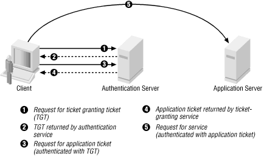

.. ==================================================
.. FOR YOUR INFORMATION
.. --------------------------------------------------
.. -*- coding: utf-8 -*- with BOM.

.. include:: ../Includes.txt

.. _admin-manual-kerberos-apache:

Configuring Kerberos for Apache
===============================

.. note:: You should skip this chapter altogether unless you wish to configure :term:`SSO` for your TYPO3 website.

.. only:: html

	**Sections:**

	.. contents::
		:local:
		:depth: 2

.. _admin-manual-kerberos-apache-scenario:

Scenario
--------

Suppose you wish to restrict access to the website ``http://intranet.example.com``. Since users allowed to connect to
this website are managed in a central directory server (LDAP / Active Directory), authentication is to be performed
using :term:`Kerberos` and :term:`SPNEGO`.

How does it work with TYPO3? What we actually want to do is as follows, from a TYPO3 point of view:

#. Delegate the authentication to the Apache web server, which should restrict access using Basic Authentication
   (theoretically by whatever means -- htpasswd file, ... -- in our case with an LDAP/Active Directory backend).
#. Trust the authenticated user whose username is sent to PHP as ``$_SERVER['REMOTE_USER']`` and rely on the TYPO3
   authentication services (in our case the one provided by this extension) to retrieve additional user information and
   group membership without checking the password, since Apache did it already.
#. To ensure these tasks are executed transparently, without having to actively authenticate in TYPO3, this extension
   sets

   .. code-block:: php

       $GLOBALS['TYPO3_CONF_VARS']['SVCONF']['auth']['setup']['FE_fetchUserIfNoSession'] = 1;

.. _admin-manual-kerberos-apache-concepts:

Understanding Kerberos concepts
-------------------------------

Kerberos Version 5 is a standard on all versions of Windows 2000 and ensures the highest level of security to network
resources. The Kerberos protocol name is based on the three-headed dog figure from Greek mythology known as Kerberos.
The three heads of Kerberos comprise the Key Distribution Center (:term:`KDC`), the client user and the server with the
desired service to access. The KDC is installed as part of the domain controller and performs two service functions:

- the Authentication Service (AS) and
- the Ticket-Granting Service (TGS).

	Three exchanges are involved when the client initially access a server resource: AS exchange (circles 1 and 2), TGS
	exchange (circles 3 and 4) and finally a client/server exchange (request shown as circle 5).

.. _admin-manual-kerberos-apache-concepts-as:

AS exchange
"""""""""""

When initially logging on to a network, users must negociate access by providing a login name and password in order to
be verified by the AS portion of a :term:`KDC`. The KDC has access to Active Directory user account information. Once
successfully authenticated, the user is granted a Ticket to Get Tickets (TGT) that is valid for the local domain (in our
example, for the realm ``example.com``). The TGT has a default lifetime of 10 hours and may be renewed throughout the
user's log-on session without requiring the user to re-enter her password.

If the KDC approves the client's request for a TGT, the reply (referred to as the AS reply) will include two sections: a
TGT encrypted with a key that only the KDC (TGS) can decrypt and a session key encrypted with the user's password hash
to handle future communications with the KDC. Because the client system cannot read the TGT contents, it must blindly
present the ticket to the GTS for service tickets. The TGT includes time to live parameters, authorization data, a
session key to use when communicating with the client and the client's name.

.. _admin-manual-kerberos-apache-concepts-tgs:

TGS exchange
""""""""""""

The user presents the TGT to the TGS portion of the :term:`KDC` when desiring access to a server service. The TGS on the
KDC authenticates the user's TGT and creates a ticket and session key for both the client and the remote server. This
information, known as the service ticket, is then cached locally on the client machine.

The TGS receives the client's TGT and reads it using its own key. If the TGS approves of the client's request, a service
ticket is generated for both the client and the target server. The client reads its portion using the TGS session key
retrieved earlier from the AS reply. The client presents the server portion of the TGS reply to the target server in the
client/server exchange coming next.

.. _admin-manual-kerberos-apache-concepts-cs:

Client/server exchange
""""""""""""""""""""""

Once the client user has the client/server service ticket, he can establish the session with the server service. The
server can decrypt the information coming indirectly from the TGS using its own long-term key with the :term:`KDC`. The
service ticket is then used to authenticate the client user and establish a service session between the server and
client. After the ticket's lifetime is exceeded, the service ticket must be renewed to use the service.

.. _admin-manual-kerberos-apache-basic-configuration:

Basic Kerberos configuration of intranet.example.com
----------------------------------------------------

The method described here as five steps:

#. Install the ``mod_auth_kerb`` authentication module.
#. Create a :term:`service principal <Principal>` for the web server.
#. Create a keytab for the service principal.
#. Specify the authentication method to be used.
#. Specify a list of authorized users or user groups.

First of all, you should make sure the clocktime of :term:`KDC`, workstation and web server is in sync (5 minutes are
the highest difference you may allow for Kerberos to work properly).

You may use `NTP <http://www.ntp.org/>`_ for that task.

.. _admin-manual-kerberos-apache-basic-configuration-module:

Installing the mod_auth_kerb authentication module
""""""""""""""""""""""""""""""""""""""""""""""""""

Within an ``intranet.example.com`` shell, install the package:

.. code-block:: bash

	$ sudo apt-get install libapache2-mod-auth-kerb krb5-user

.. hint::
	``krb5-user`` is not an actual requirement but it will provide handy command-line tools for Kerberos.

In additional to ``libapache2-mod-auth-kerb``, this will install the dependency package ``krb5-config`` and then show
you a configuration wizard asking for:

- **Default Kerberos version 5 realm.** Use ``EXAMPLE.COM``.
- **The KDC.** My Active Directory server is ``ws2008r2.example.com``, replace by your own.
- **The administration server.** This is typically the same as the LDAP/Active Directory server.

Settings you provide are then stored within configuration file :file:`/etc/krb5.conf`.

You should now check that Kerberos works on ``intranet.example.com``. Do a basic check using :command:`kinit`:

#. Ensure that ``intranet`` can reach :term:`KDC` ``ws2008rs2`` via the network (:command:`ping`, ...).
#. Have a username and password in Windows Domain ``EXAMPLE.COM``. In this example ``einstein`` is used as username.
#. Within the shell type:

   .. code-block:: bash

       $ kinit einstein@EXAMPLE.COM

   If everything is OK the command will ask you for ``einstein``'s domain password and terminates without an error message.

   .. note::
       If command fails with

       .. code-block:: none

           kinit: Cannot resolve servers for KDC in realm "example.com" while getting
           initial credentials

       then it means that you did not pay attention to writing the realm in CAPITAL LETTERS.

#. Finally use :command:`klist` to show the initial ticket you have got from the KDC:

   .. code-block:: bash

       $ klist
       Default principal: einstein@EXAMPLE.COM

       Valid starting    Expires           Service principal
       31/10/2014 13:12  31/10/2014 23:11  krbtgt/EXAMPLE.COM@EXAMPLE.COM
               renew until 01/11/2014 13:12

.. _admin-manual-kerberos-apache-basic-configuration-principal:

Creating a service principal for the web server
"""""""""""""""""""""""""""""""""""""""""""""""

:term:`SPNEGO` requires that a Kerberos service principal be created for the web server. The service name is defined to
be ``HTTP``, so for the server ``intranet.example.com`` the required service principal name is
``HTTP/intranet.example.com@EXAMPLE.COM``.

#. Create a dummy account in Windows Domain ``EXAMPLE.COM``. It is used like a machine account **but this is a standard
   user account**. In this example the name of dummy account is ``kerbdummy1``.

#. Login to the domain controller ``ws2008r2`` and use the Windows command line tool :command:`ktpass` to map the dummy
   account ``kerbdummy1`` to the service principal ``HTTP/intranet.example.com@EXAMPLE.COM``. You need that service
   principal to *kerberize* host ``intranet``:

   .. code-block:: Batch

       C:\>ktpass
         -princ HTTP/intranet.example.com@EXAMPLE.COM
         -mapuser kerbdummy1@EXAMPLE.COM
         -crypto AES256-SHA1
         -ptype KRB5_NT_PRINCIPAL
         -pass very!$longp@ssw0rd
         -out C:\\temp\\intranetkeytab

   .. note::
       If you have to target Windows XP machines, ``AES256-SHA1`` is not supported. Use the legacy crypto ``RC4-HMAC-NT``
       instead.

#. Copy file :file:`C:\\temp\\intranetkeytab` from the domain controller ``ws2008r2`` to the location where it should
   reside on host ``intranet``, in our example :file:`/etc/apache2/http_intranet.keytab` and make ``www-data``
   its owner.

   .. note::
       An alternate way to create the needed keytab file is with the help of :command:`kadmin` directly on your Linux
       machine. Please refer
       to `www.microhowto.info <http://www.microhowto.info/howto/configure_apache_to_use_kerberos_authentication.html>`_
       for instructions.

#. Check if the KDC sends correct tickets by checking in detail:

   - ticket's kvno **must** match kvno in keytab
   - principal name in ticket **must** match the principal name in keytab

   .. code-block:: bash

       $ kvno HTTP/intranet.example.com@EXAMPLE.COM
       HTTP/intranet.example.com@EXAMPLE.COM: kvno = 4

       $ klist -e
       Ticket cache: FILE:/tmp/krb5cc_0
       Default principal: HTTP/intranet.example.com@EXAMPLE.COM

       Valid starting    Expires           Service principal
       31/10/2014 14:53  01/11/2014 00:52  krbtgt/EXAMPLE.COM@EXAMPLE.COM
               renew until 01/11/2014 14:53, Etype (skey, tkt): aes256-cts-hmac-sha1-96, ...
       31/10/2014 15:09  01/11/2014 00:52  HTTP/intranet.example.com@EXAMPLE.COM
               renew until 01/11/2014 14:53, Etype (skey, tkt): arcfour-hmac, arcfour-hmac

       $ klist -e -k -t /etc/apache2/http_intranet.keytab
       Keytab name: FILE:http_intranet.keytab
       KVNO Timestamp        Principal
       ---- ---------------- ---------------------------------------------------------
          4 01/01/1970 01:00 HTTP/intranet.example.com@EXAMPLE.COM (aes256-cts-hmac-sha1-96)

#. Check that the key has been correctly added to the keytab by attempting to use it to authenticate as the service
   principal, then view the resulting ticket-granting ticket using :command:`klist`:

   .. code-block:: bash

       $ kinit -k -t /etc/apache2/http_intranet.keytab HTTP/intranet.example.com
       $ klist
       Ticket cache: FILE:/tmp/krb5cc_0
       Default principal: HTTP/intranet.example.com@EXAMPLE.COM

       Valid starting    Expires           Service principal
       31/10/2014 14:11  01/11/2014 00:10  krbtgt/EXAMPLE.COM@EXAMPLE.COM
               renew until 01/11/2014 14:11

   .. note::
       if command fails with

       .. code-block:: none

           kinit: Generic preauthentication failure while getting initial credentials

       It *may* be related to using a legacy crypto. Try to edit file :file:`/etc/krb5.conf` and update it to actively
       specify older cryptos:

       .. code-block:: none

           [libdefaults]
               default_realm = EXAMPLE.COM
               default_tkt_enctypes = rc4-hmac des-cbc-crc des-cbc-md5
               default_tgs_enctypes = rc4-hmac des-cbc-crc des-cbc-md5

.. _admin-manual-kerberos-apache-basic-configuration-authentication:

Specifying the authentication method to be used
"""""""""""""""""""""""""""""""""""""""""""""""

Apache must be told which parts of which web sites are to use authentication provided by ``mod_auth_kerb``. This is done
using the ``AuthType`` directive with a value of ``Kerberos``.

In order to protect the whole TYPO3 website, add following snippet to your virtual host configuration:

.. code-block:: ApacheConf

	<Location />
		AuthType Kerberos
		AuthName "Intranet of example.com"
		KrbMethodNegotiate on
		KrbMethodK5Passwd off
		# Allow shorter username (without realm):
		KrbAuthRealms EXAMPLE.COM
		KrbServiceName HTTP
		Krb5Keytab /etc/apache2/http_intranet.keytab
	</Location>

.. note::
	If there is a need for the web site to be accessible to its authorized users from machines that are not part on the
	Kerberos realm, you may let ``mod_auth_kerb`` ask the user for her password using basic authentication and then
	validate that password by attempting to authenticate to the KDC. Please note however that this is significantly less
	secure than true Kerberos authentication:

	.. image:: ../Images/basic-authentication.png
		:alt: Basic Authentication

	To do so, change:

	.. code-block:: ApacheConf

		KrbMethodK5Passwd on

.. _admin-manual-kerberos-apache-basic-configuration-authorization:

Specifying a list of authorized users or user groups
""""""""""""""""""""""""""""""""""""""""""""""""""""

Having an authentication method does not by itself restrict access to the web site until you disallow access by
anonymous users using ``Require`` directive:

.. code-block:: ApacheConf

	<Location />
		# ...
		Require valid-user
	</Location>

Please refer to the Apache documentation if you want to restrict access to certain users or groups (you will certainly
need to use another authorization module such as ``mod_authnz_ldap``).

Final step is to reload the Apache configuration:

.. code-block:: bash

	$ sudo apache2ctl configtest
	Syntax OK
	$ sudo service apache2 force-reload

**Sources:**

- http://www.microhowto.info/howto/configure_apache_to_use_kerberos_authentication.html
- http://www.grolmsnet.de/kerbtut/
- http://technet.microsoft.com/en-us/library/bb742516.aspx