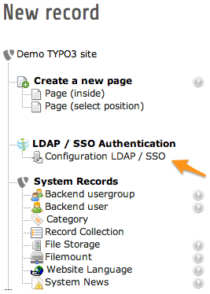
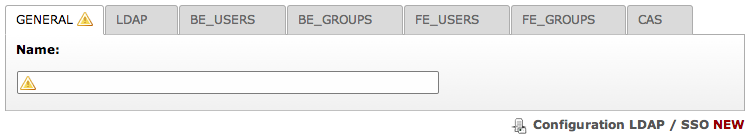

.. ==================================================
.. FOR YOUR INFORMATION
.. --------------------------------------------------
.. -*- coding: utf-8 -*- with BOM.

.. include:: ../Includes.txt

.. _admin-manual:

Administrator manual
====================

.. only:: html

	This chapter describes how to manage the extension from a superuser point of view.

	**Sections:**

	.. contents::
		:local:
		:depth: 1

First step for configuring your LDAP authentication is to create one or more server configuration records. To do this,
use module Web > List and create a record "Configuration LDAP / SSO" on the root level of your TYPO3 website (pid 0):

	When creating a new record at the root of your website, choose "Configuration LDAP / SSO".

The form to edit such a record is split in 7 tabs that we will describe separately in the next few sections

 	Edit mask of a record "Configuration LDAP / SSO"

.. _admin-manual-general:

General
-------

The only thing you have to fill is the configuration name. This is only to name the records you have just created.

.. tip:: Please note that you may create multiple configuration records with the same LDAP server.

.. _admin-manual-ldap:

LDAP
----

The second tab is the global configurations about a single LDAP server.

- **Server:** Choose your LDAP type (OpenLDAP or Novell eDirectory).

  .. note:: If you are using Active directory, your LDAP type is Novell eDirectory.

- **Protocol:** Choose the LDAP protocol version (2 or 3). Recent LDAP use version 3

- **Charset:** Character set of your LDAP connection. Usually ``utf-8``.

- **Host:** Host of your LDAP. You may use either a host name / IP address or prefix it with a protocol such as
  ``ldap://<hostname>`` or ``ldaps://<hostname>`` (latter in case you want to connect with SSL).

- **Port:** Port your LDAP uses. Default LDAP port is 389 (``ldap://``) and 636 (``ldaps://``).

- **TLS:** Whether you want to use :abbr:`TLS (Transport Layer Security)`, that is typically start with an connection
  on default port 389 and then set up an encrypted connection.

  .. note:: More information on TLS may be found at http://www.openldap.org/doc/admin24/tls.html.

- **Bind DN:** :abbr:`DN (Distinguished Name)` of the LDAP user you will use to connect to the LDAP server. The DN is
  composed of a series of :abbr:`RDN (Relative Distinguished Names)`'s which are the unique (or unique'ish) attributes at
  each level in the :abbr:`DIT (Directory Information Tree, a.k.a the naming-context)`. The following diagram
  illustrates building up the DN from the RDN's.

  .. figure:: ../Images/dit-dn-rdn.png
      :alt: DN is the sum of all RDNs

      Building up the DN (Distinguished Name) from the RDN's (Relative Distinguished Names)

  **Example:**

  ::

      cn=Robert Smith,ou=people,dc=example,dc=com

  .. note:: Your LDAP user needs to be granted access to the directory where users and groups are stored and full read
      access to users and groups for all attributes you plan to fetch.

- **Password:** Password of the user used to connect to the LDAP server.

.. _admin-manual-beusers:
.. _admin-manual-feusers:

BE_USERS and FE_USERS
---------------------

The third tab and the fifth tabs can be fill exactly the same way. The only difference between them is that BE_USERS
stores the configuration options for the backend LDAP user authentication and FE_USERS stores the configuration options
for the frontend LDAP user authentication.

You may only fill the section you need. That is, BE_USERS if you need backend authentication and FE_USERS if you need
frontend authentication.

- **Base DN:** Full DN path of the directory containing all the users that you want to use with your TYPO3
  authentification.

  **Example:**

  ::

      ou=people,dc=example,dc=com

- **Filter:** is used to precise which LDAP attribute contain the username of your users.

  Example: ``(uid={USERNAME})`` uid is the most common attribute used to keep the username in LDAP but if you are in an
  Active directory, the field where the username is stored is usually ``sAMAccountName`` instead.

  You will also be able to add restrictions that allow you to exclude user from specific properties. The syntax used in
  this field is the standard LDAP search syntax.

  **Example:**

  ::

      (&(uid={USERNAME})(objectClass=posixAccount)

  .. note:: The string ``{USERNAME}`` will be substituted by the username entered in the login form.

- **Mapping:** Used to fetch other attributes from the LDAP server that we would like users to have. It is quite simple,
  each line is a new command. Each command has two parts separated by a ``=`` (equal sign). the first part is the field
  from the TYPO3 user that we want to fill and the second part is the value that the field will have. There are three
  possible value types you may use:

  - a string: this will assign the value directly to the field

  - a LDAP attribute value: LDAP attributes will be recognized by the specific characters ``<>``.

    **Example:**

    ::

        email = <mail>

    This will set the field email of the TYPO3 user to the value of the attributes mail of the user fetch from the LDAP
    server.

  - a custom marker: custom markers are markers create by the extension to assign specific type of values. There are
    only four markers available at the moment:

    - ``{DATE}``: the current timestamp

    - ``{RAND}``: a random number

    - ``{USERNAME}``: the username from the login form ( the username will
      automatically fill the needed field. This markers is only used if you
      want to put the username in an other field than the one by default )

    - ``{hook parameters}``: will only be useful if an extension is hooked on ig_ldap_sso_auth

    **Example (BE_USERS):**

    ::

        pid = 34
        tstamp = {DATE}
        email = <mail>
        realName = <cn>
        lang = fr

    **Example (FE_USERS):**

    ::

        pid = 45
        tstamp = {DATE}
        email = <mail>
        name = <cn>
        first_name = <givenName>
        last_name = <sn>
        title = <title>
        address = <street>
        zip = <postalCode>
        city = <l>
        telephone = <telephoneNumber>

.. _admin-manual-begroups:
.. _admin-manual-fegroups:

BE_GROUPS and FE_GROUPS
-----------------------

The fourth and sixth tabs can be fill exactly the same way. The only difference between them is that BE\_GROUPS stores
the configurations for the backend LDAP usergroup association and FE\_GROUPS stores the configurations for the frontend
LDAP user group association. You will only fill the sections you need, BE\_GROUPS if you need backend authentication and
FE\_GROUPS if you need frontend authentication. You can skip this entire section if you just want to validate the
authentication and do not want to use groups from LDAP.

- **Base DN:** Full DN path of the directory containing all the groups that are related to your LDAP users and you want
  to use in your TYPO3 website.

  **Example:**

  ::

      ou=groups,dc=example,dc=com

- **Filter:** To be used only to add restrictions that allow you to exclude objects from specific properties. The
  syntax used in this field is the standard LDAP search syntax.

  **Example:**

  ::

      (objectClass=posixGroup)

  .. note:: The string ``{USERDN}`` will be substituted by the Distinguished Name (DN) of the authenticated user.

- **Mapping:** Used to fetch other attributes form the LDAP server that we would like groups to have. Please see
  syntax and examples in :ref:`admin-manual-beusers`.

.. _admin-manual-cas:

CAS
---

The last tab is for CAS configurations. You only have to fill it if you want to use a CAS server to implement some
single sign on (SSO).

- **Host:** Host of your CAS server

- **URI:** Path to append to the host used if the CAS sever is not at the root of your host.

  Example: ``/userSSo/cas`` in the string ``localhost/userSSo/cas``

- **Service URL:** Specific url for your CAS

- **Port:** Port on which you CAS is configure

- **Back URL:** URL to return to in case of a CAS login
