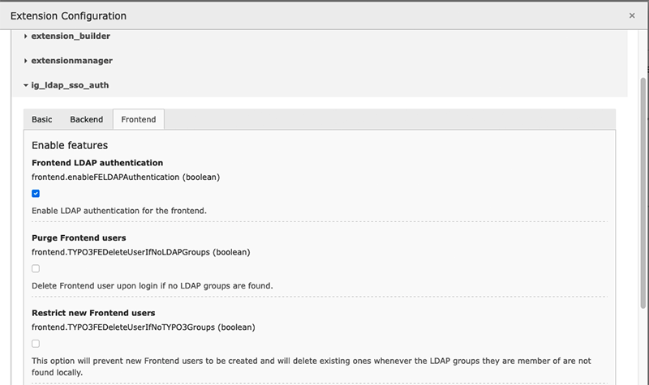

.. include:: ../Includes.rst.txt
.. _admin-manual:

Administrator manual
====================

.. only:: html

	This chapter describes how to manage the extension from an administrator
	point of view.

First step is to set a global configuration for this extension. You can do that
by opening Admin Tools > Settings and then clicking on the button "Configure
extensions" within the block "Extension Configuration". You should go through
each global option and enable what you need for your installation:

Second step for configuring your LDAP authentication is to create one or more
server configuration records. To do this, use module Web > List and create a
record "Configuration LDAP / SSO" on the root level of your TYPO3 website
(pid 0):

.. figure:: ../Images/new-record.png
	:alt: Creating a record "Configuration LDAP / SSO"

	When creating a new record at the root of your website, choose "Configuration
	LDAP / SSO".

The form to edit such a record is split in 6 tabs that we will describe
separately in the next few sections.

.. figure:: ../Images/blank-record.png
 	:alt: Edit mask for a record "Configuration LDAP / SSO"

 	Edit mask of a record "Configuration LDAP / SSO"

.. only:: html

	**Sections:**

.. toctree::
	:maxdepth: 1
	:titlesonly:

	General
	Ldap
	Users
	Groups
	Scheduler
	SampleConfiguration
	Logging
