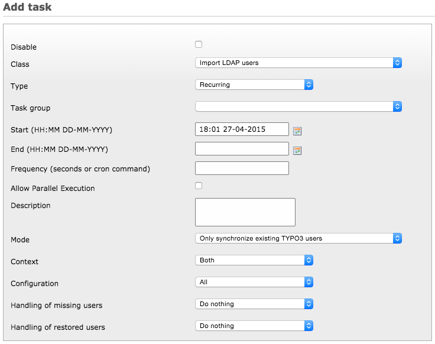

.. ==================================================
.. FOR YOUR INFORMATION
.. --------------------------------------------------
.. -*- coding: utf-8 -*- with BOM.

.. include:: ../Includes.txt

.. _admin-manual-scheduler:

Scheduler automation
--------------------

The extension provides a Scheduler task for automating the import of users from
the configured LDAP servers.

The task comes with several options, as can be seen in the Scheduler module:

	Configuration options for the Scheduler task

The options are the following:

- **Mode:** Choose to import LDAP users who are not yet available in TYPO3 or only synchronize existing TYPO3 users with
  changes from LDAP.

- **Context:** Choose to import only frontend users, backend users or both.

- **Configuration:** Choose which configuration to use, or choose "All" to automate import of users from all available
  configurations.

  .. tip::

     Disabled configurations are not considered during automation.

- **Handling of missing users:** What to do with users which are not found on the LDAP server anymore. They can be
  deleted, disabled or left as is.

- **Handling of restored users:** If user has been deleted or disabled locally, it may be automatically restored upon
  import. Each user may be either un-deleted, re-enabled or both. It can be also left as is by choosing to do nothing.
