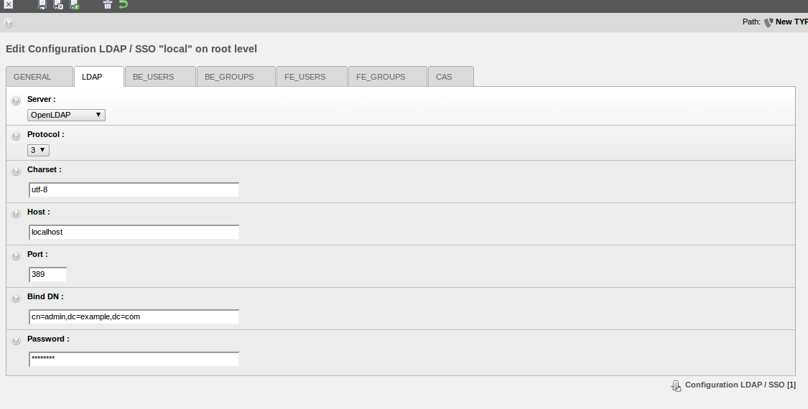
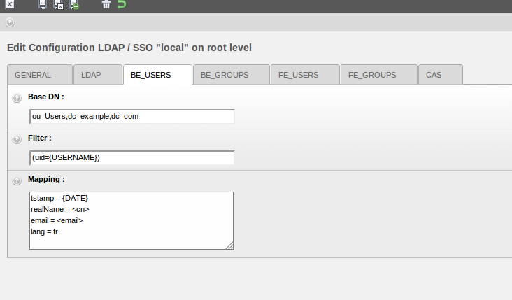
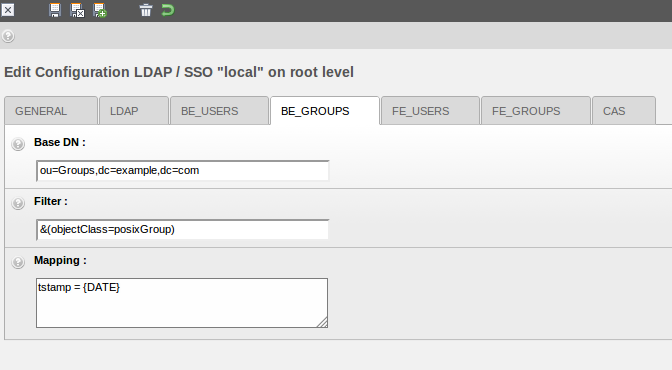
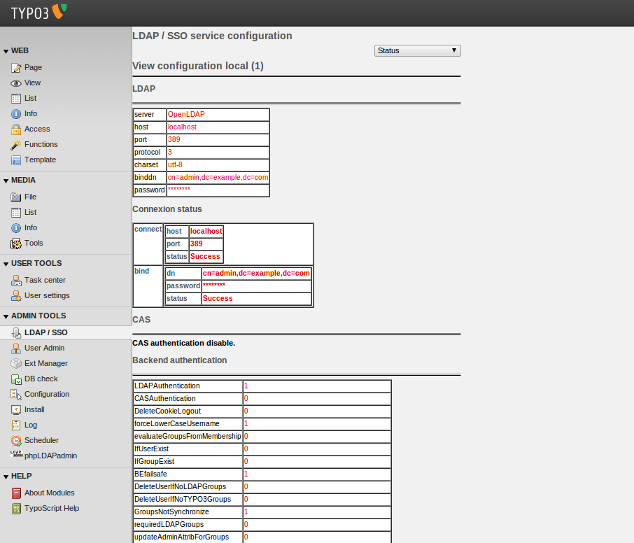

.. ==================================================
.. FOR YOUR INFORMATION
.. --------------------------------------------------
.. -*- coding: utf-8 -*- with BOM.

.. include:: ../Includes.txt

.. _introduction:

Introduction
============

.. _what-it-does:

What does it do?
----------------

This extension enables import/update/deletion of users and groups (frontend, backend or both) from a LDAP-directory.
This way, TYPO3 can be used as an intranet CMS. Multiple LDAP server configurations are allowed. Works with OpenLDAP,
Active Directory and Novell eDirectory. You can also use a CAS server to implement :abbr:`SSO (Single Sign-On)`.

.. _screenshots:

Screenshots
-----------

.. _sponsorship:

Sponsorship
-----------

This extension has been developped by Infoglobe, a Canadian company specialized in open-source software.

Support for TYPO3 6.2 LTS has been sponsored by the "Centre électronique de gestion (CEG)", technically the
IT department of the Swiss city Neuchâtel and realized by Causal Sàrl.

Further information:

- Infoglobe: http://www.infoglobe.ca/
- Centre électronique de gestion (CEG): `http://www.neuchatelville.ch/ <http://www.neuchatelville.ch/profils/admin.asp/3-3-7174-5001-4803-0-5028-2-0/1-11-160-14801-5001-1001-1-1-2-1/2-1-4803-5001-5028-2-0-100/>`_
- Causal Sàrl: https://www.causal.ch/
