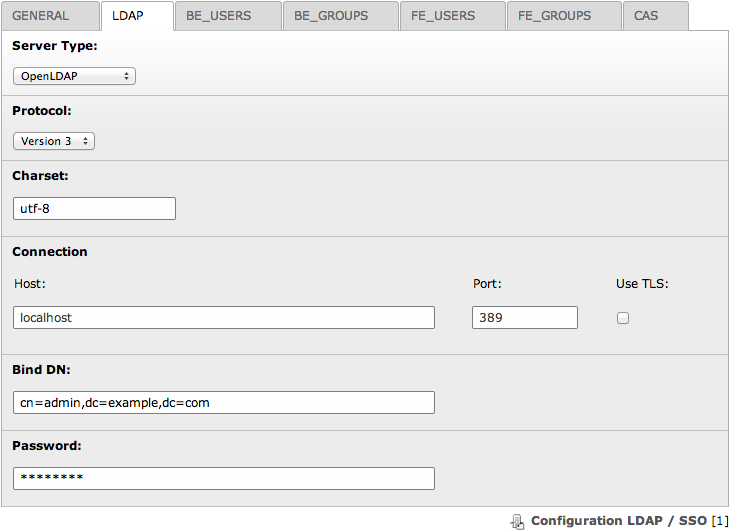
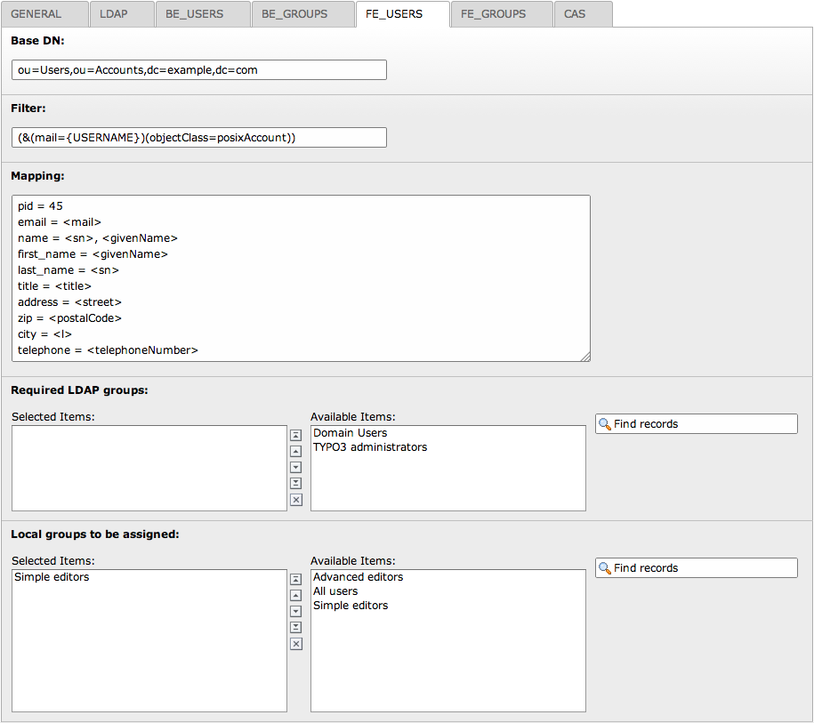
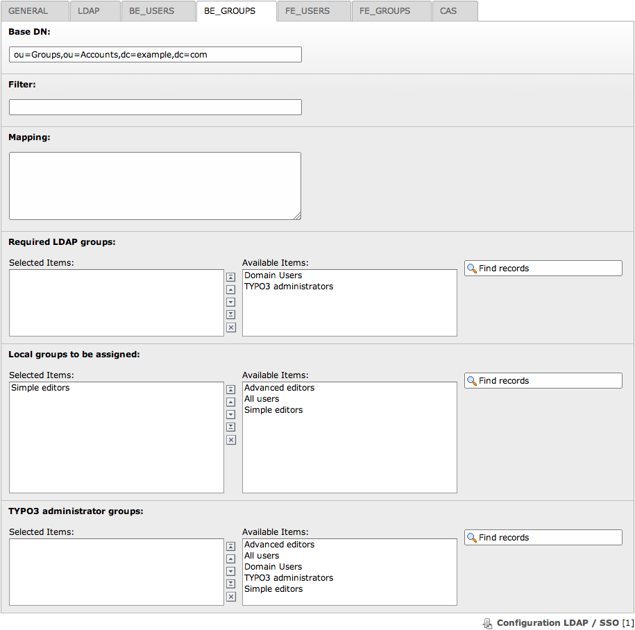
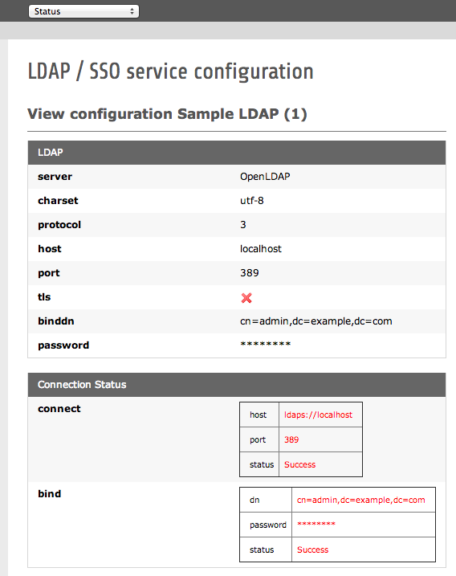
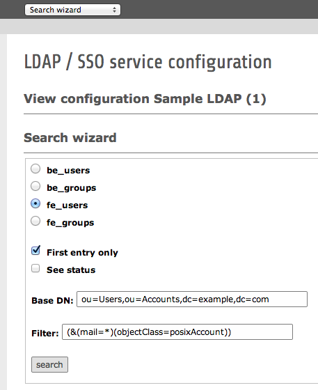

.. ==================================================
.. FOR YOUR INFORMATION
.. --------------------------------------------------
.. -*- coding: utf-8 -*- with BOM.

.. include:: ../Includes.txt

.. _introduction:

Introduction
============

.. _what-it-does:

What does it do?
----------------

This extension enables import/update/deletion of users and groups (frontend, backend or both) from a LDAP-directory and
provides Single Sign-On (:term:`SSO`) for frontend users. These features make it the perfect choice when deploying TYPO3
as an intranet CMS.

In case the network topology makes it useful, this extension is able to work with multiple LDAP server configurations,
with a priority order based on the manual sorting of configuration records.

This extension is known to work with OpenLDAP, Active Directory (various versions) and Novell eDirectory.

Please consult the :ref:`faq` for additional information.

.. _screenshots:

Screenshots
-----------

	Configuration of the connection to the LDAP server

	Configuration of the frontend authentication, how to map LDAP attributes to TYPO3 fields and which groups are
	required or should be automatically assigned

	Configuration of the retrieval of backend user groups

	Status of the LDAP connection

	Search wizard as backend module

.. _sponsorship:

Sponsorship
-----------

This extension has been initially developed by Infoglobe, a Canadian company specialized in open-source software and
has now been taken over by Causal Sàrl, a Swiss company actively contributing to TYPO3.

Support for TYPO3 6.2 LTS and some further enhancements have been sponsored by the "Centre électronique de gestion
(CEG)", technically the IT department of the Swiss city Neuchâtel.

Full user import was sponsored by the Ecole d'Etudes Sociales et Pédagogiques, in Lausanne, Switzerland.

Further information:

- Causal Sàrl: https://www.causal.ch
- Centre électronique de gestion (CEG): `http://www.neuchatelville.ch <http://www.neuchatelville.ch/ceg>`_
- Ecole d'Etudes Sociales et Pédagogiques (EESP): http://www.eesp.ch
- Infoglobe: http://www.infoglobe.ca
