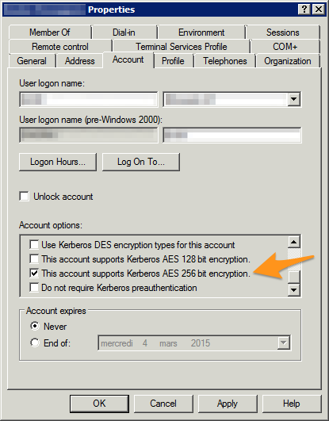

.. ==================================================
.. FOR YOUR INFORMATION
.. --------------------------------------------------
.. -*- coding: utf-8 -*- with BOM.

.. include:: ../Includes.txt

.. _sso-pitfalls:
.. _admin-manual-kerberos-apache-pitfalls:

Common pitfalls
---------------

This section describes common pitfalls while configuring SSO. Please feel free to open tickets if you encounter other
problems and found a solution.

.. _sso-pitfalls-basic-authentication:
.. _admin-manual-kerberos-apache-pitfalls-basic-authentication:

Basic authentication prompt is always shown
^^^^^^^^^^^^^^^^^^^^^^^^^^^^^^^^^^^^^^^^^^^

Problem is that, although you set ``KrbMethodK5Passd off`` in your Apache configuration, the browser of your domain
machines/computers always shows the basic authentication dialog and does not seem to silently pass your user credentials
to the web server.

Apache's error log shows:

.. code-block:: none

	[debug] [client X.X.X.X] kerb_authenticate_user entered with user (NULL) and auth_type Kerberos
	[debug] [client X.X.X.X] Acquiring creds for HTTP@intranet.example.com
	[debug] [client X.X.X.X] Verifying client data using KRB5 GSS-API
	[debug] [client X.X.X.X] Client didn't delegate us their credential
	[debug] [client X.X.X.X] GSS-API token of length 9 bytes will be sent back
	[debug] [client X.X.X.X] GSS-API major_status:000d0000, minor_status:000186a5
	[error] [client X.X.X.X] gss_accept_sec_context() failed: Unspecified GSS failure.
	                         Minor code may provide more information (, )

It turns out that although the domain controller is MS Windows Server 2008r2 and the domain machine is using MS Windows
8.1, the account does not support Kerberos AES 256 bit encryption by default.

To fix this problem, either switch to RC4 for your Apache keytab file or enable the enhanced security option for the
user accounts on your domain controller.

	Security properties of a Windows domain account

Apache's error log when everything is working properly:

.. code-block:: none

	[debug] [client X.X.X.X] kerb_authenticate_user entered with user (NULL) and auth_type Kerberos
	[debug] [client X.X.X.X] Acquiring creds for HTTP@intranet.example.com
	[debug] [client X.X.X.X] Verifying client data using KRB5 GSS-API
	[debug] [client X.X.X.X] Client didn't delegate us their credential
	[debug] [client X.X.X.X] GSS-API token of length 185 bytes will be sent back
	[debug] [client X.X.X.X] kerb_authenticate_a_name_to_local_name einstein@EXAMPLE.COM -> einstein

.. hint::
	In case you need/prefer it, a hidden option of ``mod_auth_kerb`` lets you automatically strip @EXAMPLE.COM (the
	realm) from usernames:

	.. code-block:: apache

		KrbLocalUserMapping on

Another problem with the basic authentication prompt always shown might show up as follows in Apache's error log:

.. code-block:: none

	[error] [client X.X.X.X] gss_accept_sec_context() failed: Unspecified GSS failure.
	                         Minor code may provide more information (, Wrong principal in request)

Although the reason is most probably that the reverse DNS of the web server is not exactly identical to what was
specified in the keytab file, in one case, it turned out the problem was the very same as above, namely that the account
did not support Kerberos AES 256 bit encryption.

**Sources:**

- http://www.microhowto.info/howto/configure_apache_to_use_kerberos_authentication.html
- http://www.grolmsnet.de/kerbtut/
- http://technet.microsoft.com/en-us/library/bb742516.aspx
- http://www.oracle.com/technetwork/articles/idm/weblogic-sso-kerberos-1619890.html
